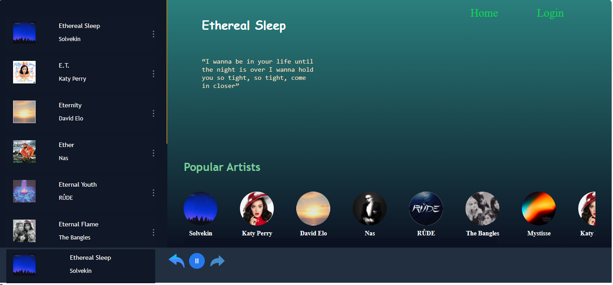
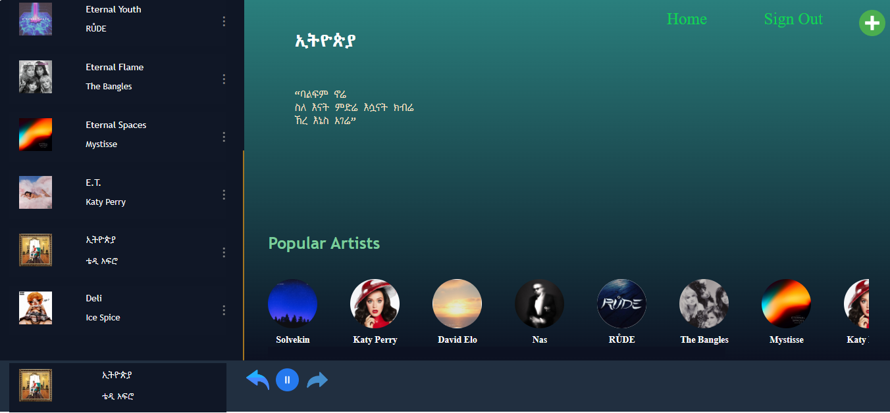
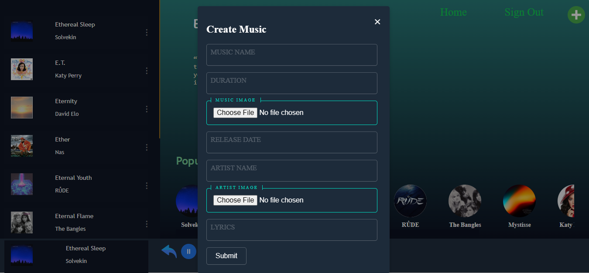

## Screenshots





## Getting Started

Follow these steps to set up and run Temene on your local machine.

### Frontend

1. Clone the repository:

   ```bash

   https://github.com/zelalem61/music-player.git
   cd music_frontend

   ```
2. Install the frontend dependencies:

  ```bash

  npm install
   
  ```
3. Start the React development server:

  ```bash

    npm start

  ```
4. Access the frontend at http://localhost:3000 in your web browser.

### Backend

1. In a separate terminal, navigate to the root folder of the Temene project:

  ```bash

  cd music_backend 

  ```
2. Install the backend dependencies:

  ```bash

  npm install

  ```

3. Start the NestJS development server:

  ```bash

  npm run start:dev

  ```
4. The backend will be running at http://localhost:3000.
